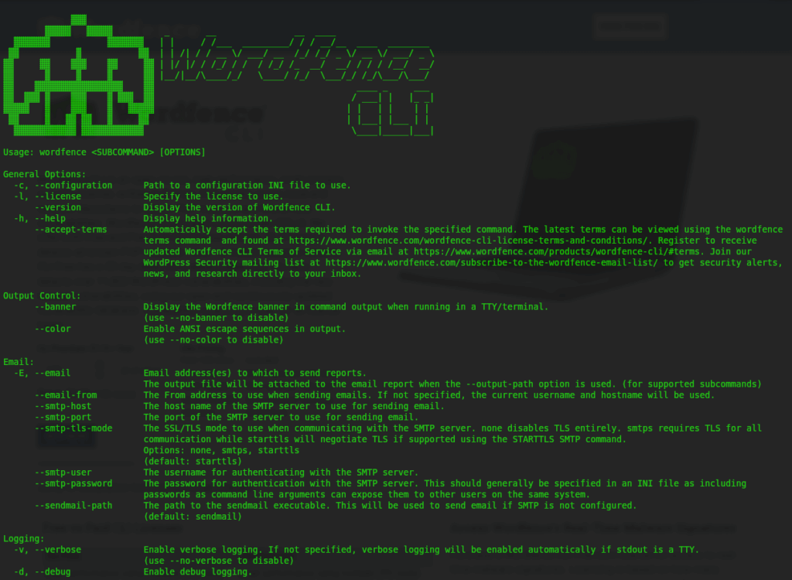

# 🛡️ WordFence CLI for HestiaCP

A powerful integration of WordFence CLI with HestiaCP, providing advanced WordPress security scanning capabilities directly from your control panel.

## 📸 Screenshots



## ✨ Features

- 🔍 **Malware Scanning**: Detect malicious code and suspicious files in WordPress installations
- 🚨 **Vulnerability Scanning**: Identify security vulnerabilities in WordPress core, themes, and plugins
- 💾 **Database Scanning**: Scan WordPress databases for malicious content and suspicious patterns
- 🔧 **File Remediation**: Automatically repair known malicious files
- 📂 **Custom Path Scanning**: Scan any directory for malware and vulnerabilities
- ⚡ **High-Performance Scanning**: Utilizes Vectorscan engine for faster and more accurate results
- 📊 **CSV Output**: All scans save results to CSV files for easy analysis and reporting
- 🔐 **Detailed Database Information**: View database connection details before scanning

## 📋 Requirements

- HestiaCP Control Panel
- Docker
- Debian-based system (Debian 10 or newer)
- Root or sudo access
- Minimum 1GB of free disk space
- Minimum 1GB of RAM (2GB recommended)
- Active internet connection

## 🚀 Installation

1. Download the installation script:
```bash
wget https://raw.githubusercontent.com/yourusername/hestia-wordfence-cli/main/wf-cli-install.sh
```

2. Make the script executable:
```bash
chmod +x wf-cli-install.sh
```

3. Run the installation script with sudo:
```bash
sudo ./wf-cli-install.sh
```

The script will:
- Check system requirements
- Install Docker if not present
- Pull the WordFence CLI Docker image
- Configure WordFence CLI
- Install all necessary command-line tools

### ⚠️ Important Notes

- The installation requires root privileges
- The script will automatically install Docker if not present
- The initial configuration process is interactive
- All scan results are saved in CSV format
- The script will create necessary directories in `/usr/local/hestia/`

## 💻 Usage

### 🔍 Malware Scanning
```bash
v-wf-malware-scan domain.com
```
Results are saved to: `public_html/wordfence-cli-scan.csv`

### ⚡ High-Performance Malware Scanning
```bash
v-wf-malware-hyperscan domain.com
```
Results are saved to: `public_html/wordfence-cli-scan.csv`

### 🚨 Vulnerability Scanning
```bash
v-wf-vulnerability-scan domain.com
```

### 💾 Database Scanning
```bash
v-wf-db-scan domain.com
```
Results are saved to: `public_html/wordfence-cli-db-scan.csv`

The database scan will display:
- Database connection details before scanning
- Scan results in the terminal
- Complete results in the CSV file

### 🔧 File Remediation
```bash
v-wf-remediate domain.com
```

### 📂 Custom Path Scanning
```bash
v-wf-scan-path /path/to/scan
```

### ⚙️ Additional Options

All commands support additional WordFence CLI parameters. For example:
```bash
v-wf-malware-scan domain.com --progress --banner
```

Common options:
- `--progress`: Show progress during scan
- `--banner`: Display WordFence banner
- `--output-format`: Specify output format (csv, json, text)
- `--output-path`: Specify output file path

## 📂 Use Cases

### Automated Scanning

The `v-wf-scan-path` command can be integrated into automated workflows:

- **Scheduled Scanning**: Set up cron jobs to run scans at specific times (e.g., daily at 2 AM)
- **Email Reporting**: Configure automated email delivery of scan results using:
  - System mail command
  - Email services (SendGrid, Mailgun, etc.)
  - SMTP integration
- **Custom Paths**: Schedule different scans for different directories:
  - Daily scans of critical paths
  - Weekly full system scans
  - Custom intervals for specific directories

## 📁 Directory Structure

```
/usr/local/hestia/
├── bin/
│   ├── v-wf-malware-scan
│   ├── v-wf-malware-hyperscan
│   ├── v-wf-vulnerability-scan
│   ├── v-wf-remediate
│   ├── v-wf-db-scan
│   └── v-wf-scan-path
├── wordfence-cli/
└── wfcli-conf/
    └── wordfence-cli.ini
```

## ⚙️ Configuration

The WordFence CLI configuration is stored in `/usr/local/hestia/wfcli-conf/wordfence-cli.ini`. You can modify this file to adjust scanning parameters and behavior.

## 🔧 Troubleshooting

### Common Issues

1. 🐳 **Docker not found**
   - Ensure Docker is installed and running
   - Run `systemctl status docker` to check Docker service status

2. 🔒 **Permission denied**
   - Ensure you have root or sudo privileges
   - Check file permissions in `/usr/local/hestia/bin/`

3. ⚙️ **Configuration issues**
   - Verify the configuration file exists at `/usr/local/hestia/wfcli-conf/wordfence-cli.ini`
   - Run the installation script again to reconfigure

4. 📊 **Scan results not appearing**
   - Check if the CSV files are created in the domain's public_html directory
   - Verify file permissions and ownership
   - Ensure the domain user has write permissions to the public_html directory

## 🤝 Contributing

Contributions are welcome! Please feel free to submit a Pull Request.

## 📄 License

This project is licensed under the MIT License - see the [LICENSE](LICENSE) file for details.

## 🙏 Acknowledgments

- [WordFence](https://github.com/wordfence/wordfence-cli) for their excellent CLI tool
- [HestiaCP](https://www.hestiacp.com/) for the control panel
- [Vectorscan](https://github.com/VectorCamp/vectorscan) for the high-performance scanning engine

## 💬 Support

For support, please:
1. Check the [troubleshooting](#troubleshooting) section
2. Open an issue on GitHub

## 📝 Changelog

### Version 1.0.0
- Initial release
- Integration with HestiaCP
- Support for all WordFence CLI features
- High-performance scanning with Vectorscan
- CSV output for all scan types and automatic cleanup of empty result files
- Detailed database connection information display
- Improved scan result handling and file management